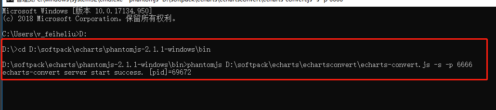

#使用模板生成Echarts图片

windows环境
1. 首先需要解压缩安装tool目录下的两个插件
2. 启动cmd命令窗口，命令行输入<phantomjs路径> <EChartsConvert路径> -s -p <服务端口号>        


3. 修改application.properties属性文件的Echarts配置的参数
4. 启动项目，传输数据即可

插件下载地址：https://gitee.com/saintlee/echartsconvert/        
            https://phantomjs.org/download.html       

命令：
D:\>cd D:\softpack\echarts\phantomjs-2.1.1-windows\bin

D:\softpack\echarts\phantomjs-2.1.1-windows\bin>phantomjs D:\softpack\echarts\echartsconvert\echarts-convert.js -s -p 6666

DEBUG模式：phantomjs --debug=yes D:\softpack\echarts\echartsconvert\echarts-convert.js -s -p 6666

两种方式Echarts图片（柱状图/折线图）：     
第一种：直接利用Java代码结合插件生成Echarts图片     
第二种：利用Freemarker模板填充数据，结合插件生成Echarts图片，以及直接生成Html页面     


------------------------------------------------------------------------------------
生成饼图:
命令：
D:\>cd D:\softpack\echarts\phantomjs-2.1.1-windows\bin

D:\softpack\echarts\phantomjs-2.1.1-windows\bin>phantomjs D:\softpack\echarts\phantomjs-2.1.1-windows\bin\echarts-pie.js -s -p 6668

-----------------------------------------------------------------------------------
说明：    
1. echarts-convert.js   这个插件js只能生成柱状图、折线图、不能生成饼图，其他图没有验证过。     
2. echarts-pie.js    这个插件js是经过改造后的，能够生成柱状图、折线图、饼图，其他图没有验证过。    
3. 利用echarts-pie.js来生成柱状图、折线图时，需要修改相关的controller代码，可以参考生成饼图的接口。主要代码如下：
    ```$xslt
    Map<String, Object> opt = (Map<String, Object>) JSONObject.parse(option);
    PhantomJS js = new PhantomJS();
    js.setOpt(opt);
    js.setReqMethod("echarts");
    js.setFile(imgUrlPath+imageName);
    PhantomJSUtil.phantomJS(JSON.parseObject(JSON.toJSONString(js)));
    ```     
    这里的option可以通过Java代码生成，也可以通过Freemarker模板生成.    
4. 在使用的时候，记得安装配置插件，参考前面的说明，并且注意端口号      
5. 利用echarts-pie.js来生成柱状图、折线图、饼图时，就不需要使用phantomjs-2.1.1-windows.zip 这个插件了     

命令：phantomjs.exe --debug=yes my.js -s -p 6668

---------------------------------------------------------------------
模板barOption1.ftl 对应echarts-util-bar.js插件，用于生成渐变色柱状图


