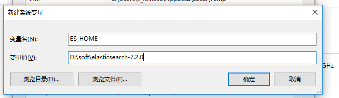
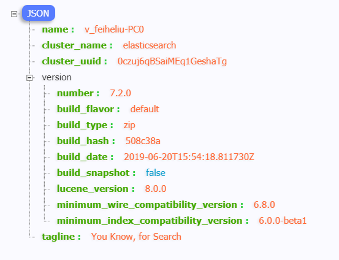
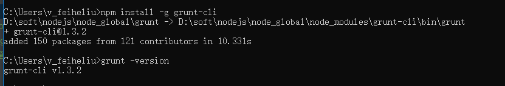
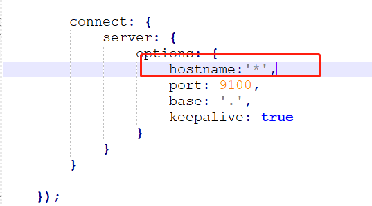
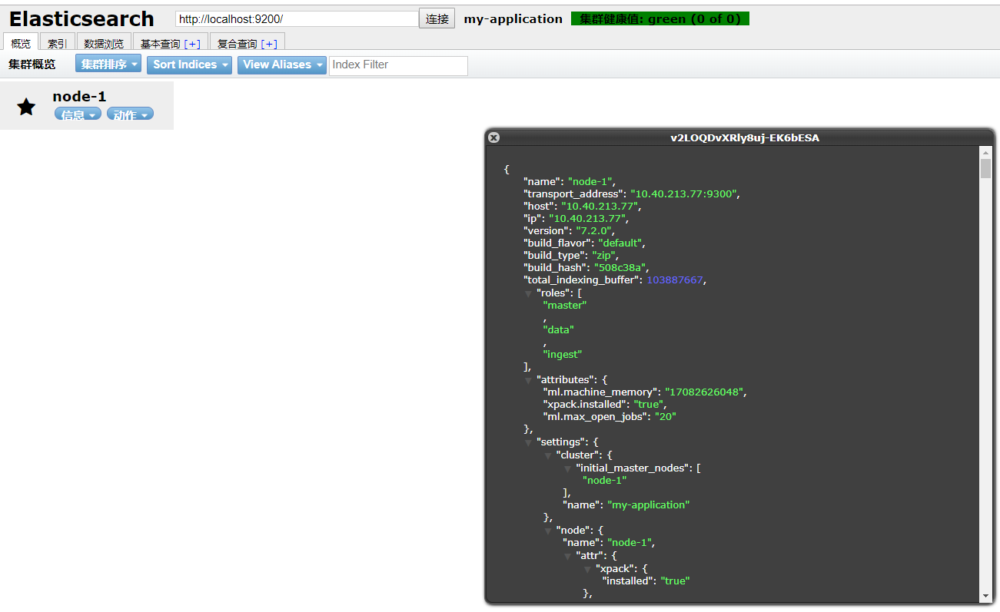
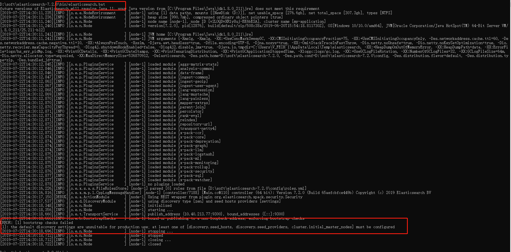

#Springboot整合Elasticsearch
Elasticsearch 是一个分布式、RESTful 风格的搜索和数据分析引擎。

Elasticsearch下载：https://www.elastic.co/cn/downloads/elasticsearch

### 在windows下安装ES
1. 将下载的安装包进行解压
2. 配置系统环境变量：
   变量名：ES_HOME, 变量值：ES的解压目录（D:\soft\elasticsearch-7.2.0）      
   
   
   编辑Path环境变量,添加：%ES_HOME%\bin\
   
   
3. 进入目录D:\soft\elasticsearch-7.2.0\bin，执行elasticsearch.bat，即可启动ES

4. 到浏览器访问：http://localhost:9200 即可看到是否安装成功。如果显示json串就表示安装成功。
   
   
### 安装ES的head插件
1. 需要安装node.js，安装过程参见：https://www.imooc.com/article/286214

2. 安装grunt，cmd命令窗口，执行命令： npm install -g grunt-cli，完成之后执行命令：grunt -version查看是否安装成功，会显示安装的版本号
   
   
3. 安装head     
   (1)进入ES安装目录下的config目录，修改elasticsearch.yml文件.在文件的末尾加入以下代码：      
     ```$xslt
     cluster.name: my-application
     node.name: node-1
     cluster.initial_master_nodes: ["node-1"]
     #如果设成0.0.0.0让任何人都可以访问，线上服务不要这样设置
     network.host: 127.0.0.1
     http.port: 9200
     # 解决elasticsearch-head 集群健康值: 未连接问题    
     http.cors.enabled: true
     http.cors.allow-origin: "*"
     node.master: true
     node.data: true
    ```                   
     然后保存    
   (2)在https://github.com/mobz/elasticsearch-head中下载head插件，选择下载zip        
   (3)elasticsearch-head下载完成之后，进入其目录修改Gruntfile.js文件，对应的位置加上hostname:'*'，如下图：              
     
   (4)重新启动elasticsearch.bat           
   (5)cmd命令进入elasticsearch-head的目录，执行命令：npm install，安装完成后执行grunt server 或者npm run start 运行head插件，如果不成功重新安装grunt。        
   (6)浏览器上访问：http://localhost:9100，即可看到效果如图  
         
        
   参考：（1）https://www.cnblogs.com/gangle/p/9328257.html        
        （2）https://blog.csdn.net/linkkb/article/details/82805145         

### 可能遇到的问题：
问题1： elasticsearch.bat启动闪退                                   
原因：允许elasticsearch跨越访问时，在修改了elasticsearch的配置文件，并且以非UTF-8的格式修改的，结果就报错了。     
解决：添加跨域访问：     
     http.cors.enabled: true     
     http.cors.allow‐origin: "*"    
     并以UTF-8的编码方式修改并保存elasticsearch.yml文件，然后重启

问题2：cmd窗口进入bin目录，执行elasticsearch.bat，之后报错，错误信息如下：      
      [1]: the default discovery settings are unsuitable for production use; at least one of [discovery.seed_hosts, discovery.seed_providers, cluster.initial_master_nodes] must be configured
      
解决办法：添加如下配置：cluster.initial_master_nodes: ["node-1"]，即可，重新启动。


     

