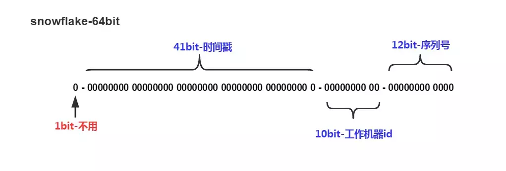

#分布式id生成器
在高并发或者分表分库情况下怎么保证数据id的幂等性呢？

经常用到的解决方案有以下几种。

微软公司通用唯一识别码（UUID）
Twitter公司雪花算法（SnowFlake）
基于数据库的id自增
对id进行缓存
这里我们要谈到snowflake算法了

snowflake是Twitter开源的分布式ID生成算法，结果是一个long型的ID。

其核心思想是：使用41bit作为毫秒数，10bit作为机器的ID（5个bit是数据中心，5个bit的机器ID），12bit作为毫秒内的流水号，最后还有一个符号位，永远是0。

snowflake算法所生成的ID结构，如下图：

整个结构是64位，所以我们在Java中可以使用long来进行存储。

该算法实现基本就是二进制操作,单机每秒内理论上最多可以生成1024*(2^12)，也就是409.6万个ID(1024 X 4096 = 4194304)

0 - 0000000000 0000000000 0000000000 0000000000 0 - 00000 - 00000 - 000000000000
1位标识，由于long基本类型在Java中是带符号的，最高位是符号位，正数是0，负数是1，所以id一般是正数，最高位是0
41位时间截(毫秒级)。注意，41位时间截不是存储当前时间的时间截，而是存储时间截的差值（当前时间截 - 开始时间截)
这里的的开始时间截，一般是我们的id生成器开始使用的时间，由我们程序来指定的（如下面程序IdWorker类的startTime属性）。41位的时间截，可以使用69年，年T = (1L << 41) / (1000L * 60 * 60 * 24 * 365) = 69
10位的数据机器位，可以部署在1024个节点，包括5位datacenterId和5位workerId

12位序列，毫秒内的计数，12位的计数顺序号支持每个节点每毫秒(同一机器，同一时间截)产生4096个ID序号
加起来刚好64位，为一个Long型。
SnowFlake的优点是，整体上按照时间自增排序，并且整个分布式系统内不会产生ID碰撞(由数据中心ID和机器ID作区分)，并且效率较高
经测试，SnowFlake每秒能够产生26万ID左右。
snowFlake算法的优点：

生成ID时不依赖于DB，完全在内存生成，高性能高可用。
ID呈趋势递增，后续插入索引树的时候性能较好。
SnowFlake算法的缺点：

依赖于系统时钟的一致性。如果某台机器的系统时钟回拨，有可能造成ID冲突，或者ID乱序
