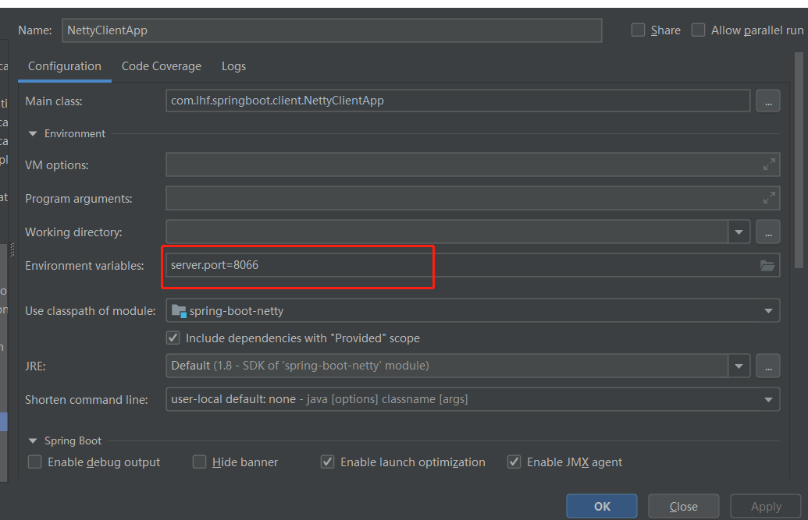

#SpringBoot整合Netty
来源：https://mp.weixin.qq.com/s/s1jYyfS4YYfZyU6VfXxW9Q

使用Protobuf传输数据：     
protocolbuffer(以下简称PB)是google 的一种数据交换的格式，它独立于语言，独立于平台。      
google 提供了多种语言的实现：java、c#、c++、go 和python，每一种实现都包含了相应语言的编译器以及库文件。          

由于它是一种二进制的格式，比使用 xml进行数据交换快许多。可以把它用于分布式应用之间的数据通信或者异构环境下的数据交换。           
作为一种效率和兼容性都很优秀的二进制数据传输格式，可以用于诸如网络传输、配置文件、数据存储等诸多领域。              

官方地址：https://github.com/google/protobuf        
下载地址：https://github.com/protocolbuffers/protobuf/releases/tag/v3.9.0

使用方法：      
1. 创建一个proto文件，这里为User.proto，内容包含用户的编号，姓名，年龄等，见项目的protobuf目录。     
2. 创建好之后，我们把User.proto和protoc.exe文件放到E盘目录下的protobuf文件夹下，然后在该目录下执行命令：protoc.exe --java_out=文件绝对路径名称。
   如：protoc.exe --java_out=E:\protobuf User.proto
3. 执行之后，将会在同级目录下看到生成的java文件，然后将生成的java文件放到我们的项目中即可。

主要实现的业务逻辑：        
服务端启动成功之后，客户端也启动成功，这时服务端会发送一条protobuf格式的信息给客户端，然后客户端给予相应的应答。
客户端与服务端连接成功之后，客户端每隔一段时间会发送心跳指令给服务端，告诉服务端该客户端还存活中，如果客户端没有在指定的时间发送信息，服务端会关闭与该客户端的连接。
当客户端无法连接到服务端之后，会每隔一段时间去尝试重连，只到重连成功!

使用Netty编写业务层的代码，我们需要继承ChannelInboundHandlerAdapter 或SimpleChannelInboundHandler类:     
(1)继承SimpleChannelInboundHandler类之后，会在接收到数据后会自动release掉数据占用的Bytebuffer资源。并且继承该类需要指定数据格式。          
(2)继承ChannelInboundHandlerAdapter则不会自动释放，需要手动调用ReferenceCountUtil.release()等方法进行释放。继承该类不需要指定数据格式。           
推荐服务端继承ChannelInboundHandlerAdapter，手动进行释放，防止数据未处理完就自动释放了。而且服务端可能有多个客户端进行连接，并且每一个客户端请求的数据格式都不一致，这时便可以进行相应的处理。    

客户端根据情况可以继承SimpleChannelInboundHandler类。好处是直接指定好传输的数据格式，就不需要再进行格式的转换了。     

在启动客户端和服务端时，记得修改启动端口，否则启动报错。

