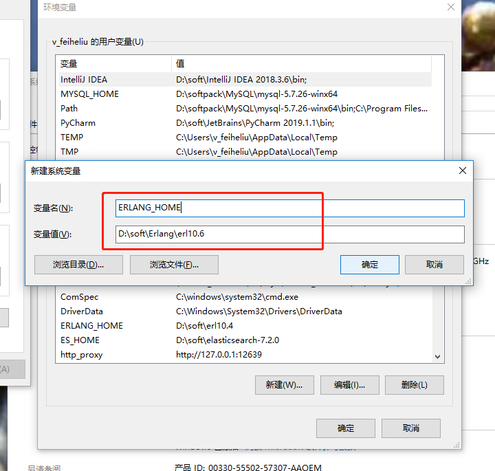
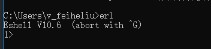
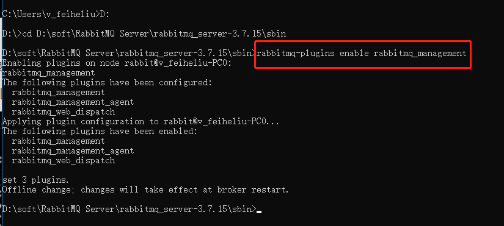
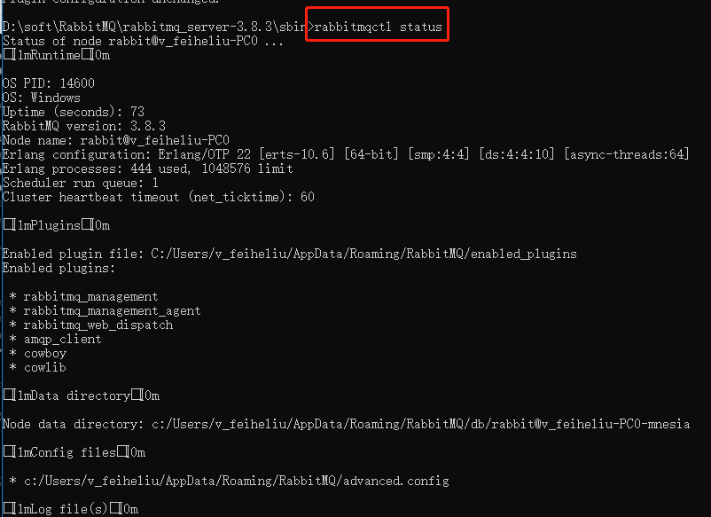
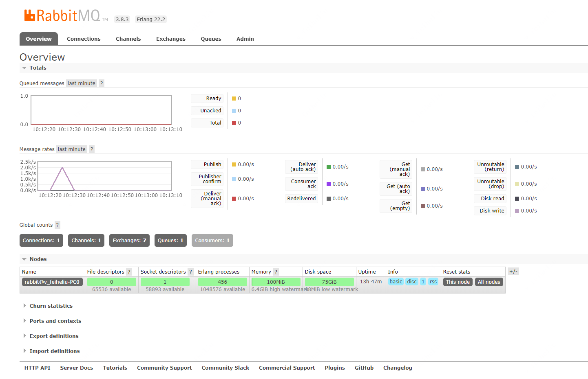

#SpringBoot整合RabbitMQ

以windows环境为例（https://www.cnblogs.com/saryli/p/9729591.html）：           
在windows下安装配置RabbitMQ，步骤如下：               
1. 下载并安装erlang插件，下载地址：https://www.erlang.org/downloads，下载完成之后，进行安装，然后配置环境变量。      
    新建环境变量，变量名：ERLANG_HOME，变量值：erlang安装的路径，具体如下图
    
    然后配置path变量：%ERLANG_HOME%\bin          
    配置完成之后，打开cmd命令窗口进行查看，输入命令：erl  
    

2. 下载安装RabbitMQ，下载地址：https://www.rabbitmq.com/download.html，双击下载后的.exe文件，安装过程与erlang的安装过程相同。

3. RabbitMQ安装好后接下来安装RabbitMQ-Plugins。打开命令行cd，输入RabbitMQ的sbin目录，然后输入如下命令：       
   rabbitmq-plugins enable rabbitmq_management     
   进行安装,如图：
   
   
4. 打开命令行命令行,进入RabbitMQ的安装目录的sbin中 ,输入 rabbitmqctl status , 如果出现以下的图，说明安装是成功的，并且说明现在RabbitMQ Server已经启动了,运行正常。
   

5. 打开sbin目录，双击rabbitmq-server.bat，启动rabbitmq，然后访问http://localhost:15672，输入默认用户名和密码都是guest登陆即可。
   
   
6. 启动项目，查看效果  

rabbitmq添加用户：            
添加用户：          
rabbitmqctl add_user admin admin

设置permissions：           
rabbitmqctl set_permissions -p "/" admin ".*" ".*" ".*"

设置用户角色：              
rabbitmqctl set_user_tags admin administrator

查看新添加的admin：         
rabbitmqctl list_users

遇到的错误：      
错误描述： Error creating bean with name 'springBootRabbitmq1Application': Invocation of init method failed; nested exception is org.springframework.amqp.AmqpIOException: java.net.SocketTimeoutException: connect timed out

解决办法：查看你的配置文件看是否配置正确

15672端口 ：表示 RabbitMQ 控制台端口号，可以在浏览器中通过控制台来执行 RabbitMQ 的相关操作。

5672端口 : 表示 RabbitMQ 所监听的 TCP 端口号，应用程序可通过该端口与 RabbitMQ 建立 TCP 连接，并完成后续的异步消息通信

Overview ：用于查看 RabbitMQ 的一些基本信息（消息队列、消息发送速率、节点、端口和上下文信息等）

Connections：用于查看 RabbitMQ 客户端的连接信息

Channels：用户查看 RabbitMQ 的通道信息

Exchange：用于查看 RabbitMQ 交换机

Queues：用于查看 RabbitMQ 的队列

Admin：用于管理用户，可增加用户
