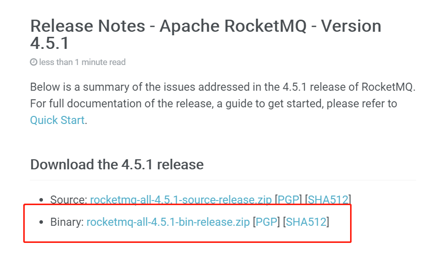

## SpringBoot整合RocketMQ

RocketMQ下载地址：http://rocketmq.apache.org/year-archive/  
这里以RocketMQ的4.5.1版本为例：        
[下载地址](http://rocketmq.apache.org/release_notes/release-notes-4.5.1/ )    

以windows为例：  
1. 下载解压之后，需要配置环境变量，以我的目录为例，目录：D:\soft\RocketMQ\rocketmq-4.5.1              
配置系统环境变量：     
变量名：ROCKETMQ_HOME             
变量值：MQ解压路径\MQ文件夹名，这里是：D:\soft\RocketMQ\rocketmq-4.5.1      

2. 启动cmd命令窗口，进入RocketMQ的解压目录下的bin目录中，启动RocketMQ服务，启动命令：start mqnamesrv.cmd   

3. 另外启动一个cmd命令窗口，进入RocketMQ的解压目录下的bin目录中，启动broker服务，启动命令：mqbroker -n 127.0.0.1:9876      
保持两个cmd窗口不关闭。

               
