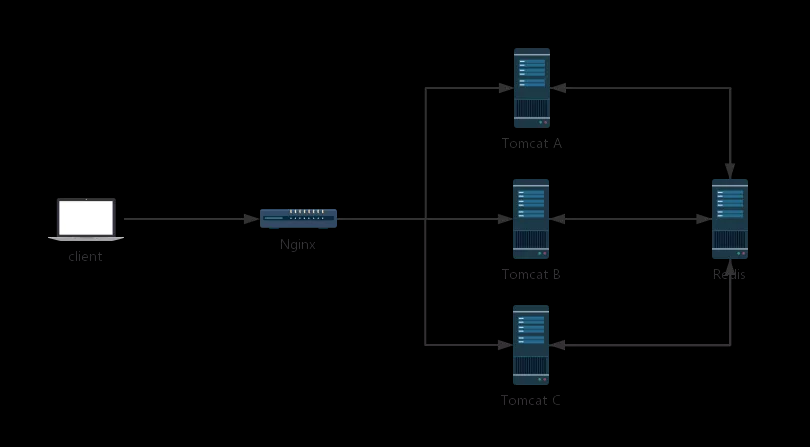

#SpringBoot结合redis实现session共享

一般来说，只有一个服务器，那么不存在 Session 共享问题，但是在分布式/集群项目中，Session 共享则是一个必须面对的问题

在这样的架构中，会出现一些单服务中不存在的问题，例如客户端发起一个请求，这个请求到达 Nginx 上之后，被 Nginx 转发到 Tomcat A 上，然后在 Tomcat A 上往 session 中保存了一份数据，下次又来一个请求，这个请求被转发到 Tomcat B 上，此时再去 Session 中获取数据，发现没有之前的数据。对于这一类问题的解决，思路很简单，就是将各个服务之间需要共享的数据，保存到一个公共的地方（主流方案就是 Redis）：

当所有 Tomcat 需要往 Session 中写数据时，都往 Redis 中写，当所有 Tomcat 需要读数据时，都从 Redis 中读。这样，不同的服务就可以使用相同的 Session 数据了。

这样的方案，可以由开发者手动实现，即手动往 Redis 中存储数据，手动从 Redis 中读取数据，相当于使用一些 Redis 客户端工具来实现这样的功能，毫无疑问，手动实现工作量还是蛮大的。

一个简化的方案就是使用 Spring Session 来实现这一功能，Spring Session 就是使用 Spring 中的代理过滤器，将所有的 Session 操作拦截下来，自动的将数据 同步到 Redis 中，或者自动的从 Redis 中读取数据。

对于开发者来说，所有关于 Session 同步的操作都是透明的，开发者使用 Spring Session，一旦配置完成后，具体的用法就像使用一个普通的 Session 一样。

来源：https://mp.weixin.qq.com/s/z10nN1LlD3izv9R6ftQQEw

