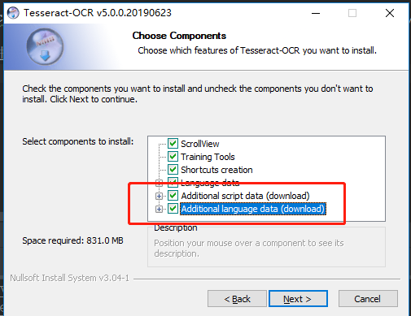

#Spring Boot + Tesseract 实现快速图片内容转文字
来源：https://mp.weixin.qq.com/s/5CrpfSrH47CzPi5IR19Kwg

光学字符识别（OCR）被设计成一种允许计算机以文本形式“阅读”图形化内容的方法，和人类工作的方式相似。虽然这些系统相对准确，但仍然可能有相当大的偏差。即便如此，修复系统的错误结果也远比手工从头开始要更加容易和快速。     

 Google 一直在开发一个 OCR 引擎 Tesseract ，它从最初诞生到现在已有数十年的历史。它为许多语言提供了API，不过我们将专注于 Tesseract 的 Java API 。
很容易使用 Tesseract 来实现一个简单的功能。它主要用于读取计算机在黑白图片上生成的文字，并且结果的准确度较好。但这不是针对真实世界的文本。

###安装tesseract    
tesseract下载地址：https://digi.bib.uni-mannheim.de/tesseract/   
github地址：https://github.com/tesseract-ocr/tesseract       

1. 下载之后进行安装，记得选项语言包，如下：
   

2. 然后将安装目录地址添加到系统环境变量path中

3. 验证是否安装成功：tesseract -v   打印出相关的版本信息即为成功

4. 进行文字图片识别，识别命令：tesseract 图片路径 结果文件名 -l 语言         
 (1)cmd命令切换到所在图片的目录下，假设图片名为：image.jpg, 需要转化的文字是英文，命令如下：         
   tesseract image.jpg test -l eng       
 (2)cmd命令切换到所在图片的目录下，假设图片名为：image.jpg, 需要转化的文字是中文，命令如下：   
   tesseract image.jpg test -l chi_sim    

注意：识别命令：tesseract 图片路径 结果文件名 -l 语言
   1、将 cmd 切换到图片所在路径，则可以只输入图片名，否则需要全路径
   
   2、结果文件名不可以加后缀，必定会自动加 .txt 后缀，如果结果文件名写 a.txt，则最后输出的文件名为 a.txt.txt。
   
   3、-l 是英文字母L，不是数字1，language的意思。
   
   4、语言英文为 eng，简体中文为 chi_sim
     
    
中文存在误差

参考：https://blog.csdn.net/wsk1103/article/details/54173282

