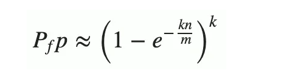
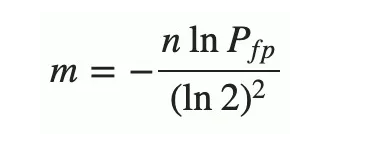
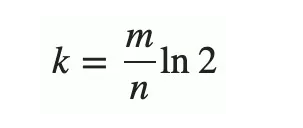

布隆过滤器（Bloom Filter）是 1970 年由布隆提出的。它实际上是一个很长的二进制向量和一系列随机映射函数。布隆过滤器可以用于检索一个元素是否在一个集合中。它的优点是空间效率和查询时间都比一般的算法要好的多，缺点是有一定的误识别率和删除困难。

布隆过滤器常见的应用场景如下：           
1. 网页爬虫对 URL 去重，避免爬取相同的 URL 地址；
2. 反垃圾邮件，从数十亿个垃圾邮件列表中判断某邮箱是否垃圾邮箱；
3. Google Chrome 使用布隆过滤器识别恶意 URL；
4. Medium 使用布隆过滤器避免推荐给用户已经读过的文章；
5. Google BigTable，Apache HBbase 和 Apache Cassandra 使用布隆过滤器减少对不存在的行和列的查找。
除了上述的应用场景之外，布隆过滤器还有一个应用场景就是解决缓存穿透的问题。所谓的缓存穿透就是服务调用方每次都是查询不在缓存中的数据，这样每次服务调用都会到数据库中进行查询，如果这类请求比较多的话，就会导致数据库压力增大，这样缓存就失去了意义。

   利用布隆过滤器我们可以预先把数据查询的主键，比如用户 ID 或文章 ID 缓存到过滤器中。当根据 ID 进行数据查询的时候，我们先判断该 ID 是否存在，若存在的话，则进行下一步处理。若不存在的话，直接返回，这样就不会触发后续的数据库查询。需要注意的是缓存穿透不能完全解决，我们只能将其控制在一个可以容忍的范围内。


布隆过滤器算法公式：    
布隆过滤器有一个可预测的误判率（FPP）：


n 是已经添加元素的数量；
k 哈希的次数；
m 布隆过滤器的长度（如比特数组的大小）。          
极端情况下，当布隆过滤器没有空闲空间时（满），每一次查询都会返回 true 。这也就意味着 m 的选择取决于期望预计添加元素的数量 n ，并且 m 需要远远大于 n 。

实际情况中，布隆过滤器的长度 m 可以根据给定的误判率（FFP）的和期望添加的元素个数 n 的通过如下公式计算：


对于 m/n 比率表示每一个元素需要分配的比特位的数量，也就是哈希函数 k 的数量可以调整误判率。通过如下公式来选择最佳的 k 可以减少误判率（FPP）：



结论，当我们搜索一个值的时候，若该值经过 K 个哈希函数运算后的任何一个索引位为 ”0“，那么该值肯定不在集合中。但如果所有哈希索引值均为 ”1“，则只能说该搜索的值可能存在集合中。


pom.xml配置:
```java
<dependency>
   <groupId>com.google.guava</groupId>
   <artifactId>guava</artifactId>
   <version>28.0-jre</version>
</dependency>
```


在 BloomFilter 内部，误判率 fpp 的默认值是 0.03：
```java
// com/google/common/hash/BloomFilter.class
public static <T> BloomFilter<T> create(Funnel<? super T> funnel, long expectedInsertions) {
  return create(funnel, expectedInsertions, 0.03D);
}
```
